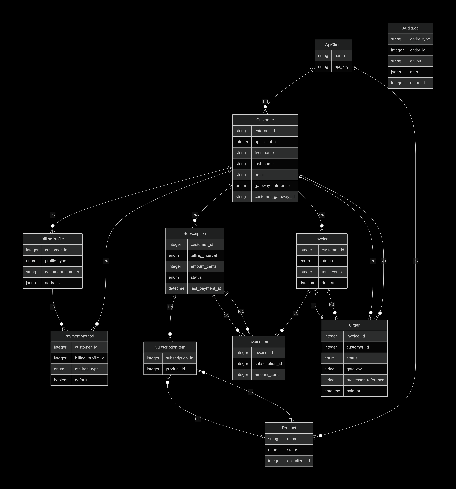

## Data modeling

### ApiClient
- name
- api_key

Associations:
- has_many :customers, dependent: :destroy
- has_many :subscriptions, through: :customers
- has_many :invoices, through: :customers

Indexes:
- unique(api_key)

---

### Customer
- external_id
- api_client_id
- first_name
- last_name
- email
- gateway_reference (enum: pagar_me, asaas)
- customer_gateway_id

Associations:
- belongs_to :api_client
- has_many :billing_profiles, dependent: :destroy
- has_many :payment_methods, dependent: :destroy
- has_many :subscriptions, dependent: :destroy
- has_many :invoices, dependent: :destroy

Indexes:
- unique(api_client_id, external_id)

---

### BillingProfile
- customer_id
- profile_type (enum: individual, company)
- document_number
- address (jsonb)

Associations:
- belongs_to :customer
- has_many :payment_methods, dependent: :destroy

---

### PaymentMethod
- customer_id
- billing_profile_id
- method_type (enum: credit_card, pix, boleto)
- default

Associations:
- belongs_to :customer
- belongs_to :billing_profile

---

### Product
- name
- status (enum: active, inactive)
- api_client_id

Associations:
- belongs_to :api_client
- has_many :subscription_items, dependent: :destroy
- has_many :subscriptions, through: :subscription_items

---

### Subscription
- customer_id
- billing_interval (enum: monthly, yearly)
- amount_cents
- status (enum: active, canceled, paused)
- last_payment_at

Associations:
- belongs_to :customer
- has_many :subscription_items, dependent: :destroy
- has_many :products, through: :subscription_items

---

### SubscriptionItem
- subscription_id
- product_id

Associations:
- belongs_to :subscription
- belongs_to :product

---

### Invoice
- customer_id
- status (enum: open, paid, failed, canceled)
- total_cents
- due_at

Associations:
- belongs_to :customer
- has_many :invoice_items, dependent: :destroy
- has_many :orders, dependent: :restrict_with_exception

Indexes:
- index(customer_id, due_at)

---

### InvoiceItem
- invoice_id
- subscription_id
- amount_cents

Associations:
- belongs_to :invoice
- belongs_to :subscription

---

### Order
- invoice_id
- customer_id
- status (enum: pending, paid, failed)
- gateway
- processor_reference
- paid_at

Associations:
- belongs_to :invoice
- belongs_to :customer

Indexes:
- unique(invoice_id)

---

### AuditLog
- entity_type
- entity_id
- action
- data
- actor_id

Indexes:
- index(actor_id)
- index(entity_type, entity_id)

## DB ERD

